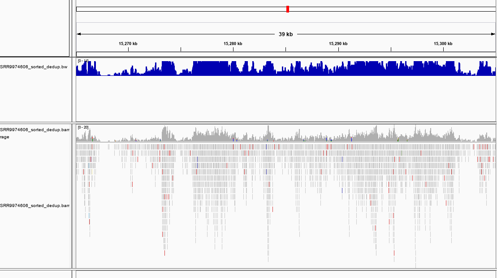

# Report about bam file from GMI

ツールが正常に動いているかどうかは、SRR9974606を用いて確認した。本ファイルはpipeline.shを用いて作成した。reference genomeとしてJGI5のゲノムを使用した。

## GMIのbamファイルは正常なbamファイルではない

まず、samtoolsを使ってsort及びindexの付与を行った。

```bash
#!/bin/bash

# samtools sort and index
```bash
for file in `ls *.bam`; do
    echo ${file%.bam}
    sorted_bam=${file%.bam}_sorted.bam
    samtools sort $file > $sorted_bam
    samtools index $sorted_bam
done
```

次に、sortとindexを行ったファイルに対してbigwig変換をdeeptoolsの`bamCoverage`コマンドで試みた。

```bash
#!/bin/bash

# bam2bigwig

for file in `ls *_sorted.bam`; do
    bamCoverage --bam -o ${$file%.bam}.bw -of --bigwig 
done;
```

SRR9974606では正常にbigwigに変換することができた。IGVでもsortされたbamファイル及びbigwigファイルは可視化できた（図. 1）。

<figure>
    
    <figcaption>
        <b>SRR9974606のbam及びbigwigファイルのIGVによる可視化</b><br>
    </figcaption>
</figure>

以下のエラーが起きたので、BAMファイルのフォーマットが異常であると考えられた。

```bash
The file '105607_GCCAAT_HWMLYBGXC_1_20200114B_20200114_sorted.bam' does not have BAM or CRAM format
```

そこで、samtoolsを用いてBAMの中身を確認した。

```bash
for file in `ls *.bam`; do 
    samtools view $file | head -n 100 > $file.n100.txt
done
```

その結果、正常なBAMと異なり、リードの位置情報などが失われていた。（10...n100.txt）
正常に変換、可視化ができたbamファイルでは、情報が完全に残っていた。
